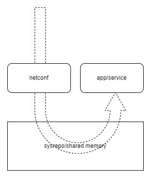
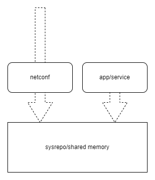

# Sysrepo design choices/questions
## Caveat Emptor

I have used sysrepo as distributed by Ubuntu 21.10. This version (`1.4.70`) is a lot older than the currently released version which is 2.0.53 (as of 2021-12-13). The examples on the master branch on https://github.com/sysrepo/sysrepo uses an API that is not consistent with the version on Ubuntu. If you want to run the examples in this repository, you may need to have a look at the examples in the offical sysrepo repository, and adjust the code accordingly. The API changes aren't huge, so there shouldn't be any issues. The examples affected by the API difference have been documented as such. 

## Direct or indirect integration?

As the diagram in https://netopeer.liberouter.org/doc/sysrepo/master/html/ illustrates, there are two major approaches to integrate applications with sysrepo:


- Direct approach - modify application and link against libsysrepo (and possibly libyang)
- Indirect approach - write a separate application that handles configuration only, and bridge to existing application using configuration files and signals for configuration reload

The linked page refers to a third approach, and that is to utilize the `sysrepo-plugind` daemon. That is however just a _variation_ of the indirect approach. From an application developer's (us) perspective, the question is "do we want to modify existing applications or not?".

If we can afford it, we should go for the direct approach as the memory pressure will be as low as possible. There's also already an abstraction layer for configuration in WeOS, so the needed modifications for a direct integration should only affect the configuration layer, and not the applications themselves.

Should it turn out that direct approach isn't feasible for some reason, the `sysrepo-plugind` is the better choice. It would only add _one_ more process to the system, as opposed to _n_ new processes.

## Application/service process considerations
### Push vs pull
Configuration values, as well as any changes to the configuration, is normally pulled from the _running datastore_ by applications and services. State (values that are not a result of a configuration, e.g. _temperature_) is handled a bit differently. State is either _pushed_ or _pulled_ by the state provider (the application/service). The choice of which method to use does not have to be set in stone, and should be considered on a case by case basis. When a state provider offers state using the pull model, it basically means that a callback is called in the state provider asking for the state. In the push model, the application updates the state when needed in sysrepo, and state readers may fetch the latest state at any time.

<div>

<br/>
<span style="font-style: italic">The pull model</span>

<p>In the pull model, requests originate from the outside world (via NETCONF, CLI, or any other client). The request is intercepted in sysrepo via its API. Sysrepo notices that there is no value in the operational datastore for the yang module, and will see if there is a pull callback registered for the requested value(s). The pull callback is found and called. The result from the callback is then returned to the sysrepo API caller, and will be returned as a response to the request originator.</p>
</div>

<div>

<br/>
<span style="font-style: italic">The push model</span>

<p>In the push model, requests originate from the outside world (via NETCONF, CLI, or any other client). The request is intercepted in sysrepo via its API, and is grounded there. Any value found in the operational datastore is returned immediately. If no value has been recorded, default values (according to YANG model) is returned. The app that is responsible for providing state values can update sysrepo at any time. The last updated value is returned to all requests from the outside world.</p>
</div>

### Warning: resource leaks
Sysrepo uses shared memory to operate. Such memory is not automatically reclaimed when a process terminates. It is therefore _vital_ that all sysrepo resources are released on process termination. All signals that can be handled and that terminates the process must release the sysrepo resources before allowing the process to terminate. The use of `atexit()` is also encouraged so that normal program termination is not forgotten.

<hr/>

# Repo source code
The repo source code contains examples that highlight the core concepts in sysrepo.

## Preparations
Make sure you have installed sysrepo. On Ubuntu, run
```sh
$ sudo apt install sysrepo libsysrepo-dev
```

For other Linux distributions, please have a look with your preferred distribution's package manager.

## set-get-config
Illustrates how to retrieve and update a configuration value. Typically, an application would get configuration values from the running data store. A configuration tool, or some other process, would set the configuration value.

The example has a very simple YANG module definition that defines a single configuration value of type uint32. The application simply increments it for each run, and then iterates through all values in the module and prints them to stdout.

### Running
Install the YANG module by
```sh
$ make install-yang
```

Build by
```sh
$ make
```

And run as
```sh
$ ./set-get-config
```

## observer
Illustrates how a service can observe any YANG module in sysrepo (entire modules in this case, but can be narrowed done with XPath).

The example has a very simple YANG module definition that defines a single configuration value of type uint32. The `service` (the observer) registers a subscription callback for the entire module `observer`, and no XPath (`NULL`). A change to the module is done using `simulate-change` (typically, the change would've come from a NETCONF client, but to keep the example short and to the point, this is what you get!). `simulate-change` will write a random value between `0` and `100`. `service` will see the changes as events, and print values to the terminal.

### Running
Install the YANG module by
```sh
$ make install-yang
```

Build by
```sh
$ make
```

Run service as
```sh
$ ./service
```

Simulate a change in the sysrepo values with
```sh
$ ./simulate-change
```

### Demonstrated aspects
What is demonstrated in this example is the following aspects:
- Any change to a subscribe module (or part of module) can be observed
- Any service can listen to any module - two or more services can depend on the same configuration, e.g. _hostname_
- Changes are delivered as they are changed AND as they are committed (or aborted) (`SR_EV_CHANGE` vs `SR_EV_DONE` and `SR_EV_ABORT`). Allows for two phase commit transactions within the system.

N.B. The original source code in https://github.com/sysrepo/sysrepo/blob/master/examples/application_changes_example.c is for a more recent version of sysrepo than what is available on Ubuntu 21.10, and does not compile as is! Notably, the subscription callback function has changed.

## pull-state
Illustrates how a service can provide state in a "pull" manner via a callback to provide state to the operational data store.

The example has a very simple YANG module definition that defines a single configuration value of type uint32. The `service` (the state provider) registers a callback for the entire module `state`. Any read for this module from the _operational datastore_ will trigger a call to this callback. The callback's job is to provide data for the state the service maintains. The service will update a random value every 100 ms, and send it off to the requester in the callback.

The state value is fetched via a separate client application (typically netconf/netopeer as a response to a network request or CLI request).

### Running
Install the YANG module by
```sh
$ make install-yang
```

Build by
```sh
$ make
```

Run service as
```sh
$ ./service
```

Run the client to get the state value
```sh
$ ./client
```

### Demonstrated aspects
What is demonstrated in this example is the following aspects:
- State can be _pulled_ from a service by a client via a callback
- The difference between running and operational data store - the service provides state to the _running_ datastore, while the client pulls it from the _operational_ datastore.

N.B. The original source code in https://github.com/sysrepo/sysrepo/blob/master/examples/application_changes_example.c is for a more recent version of sysrepo and libyang than what is available on Ubuntu 21.10, and does not compile as is! Notably, the callback function and the libyang API for creating configuration nodes have changed.

## push-state
Illustrates how a service can provide state in a "push" manner via a callback to provide state to the operational data store.

The example has a very simple YANG module definition that defines a single configuration value of type uint32. The `service` (the state provider) registers a callback for the entire module `state`. Any read for this module from the _operational datastore_ will trigger a call to this callback. The callback's job is to provide data for the state the service maintains. The service will update a random value every 100 ms, and send it off to the requester in the callback.

The state value is fetched via a separate client application (typically netconf/netopeer as a response to a network request or CLI request).

### Running
Install the YANG module by
```sh
$ make install-yang
```

Build by
```sh
$ make
```

Run service as
```sh
$ ./service
```

Run the client to get the state value
```sh
$ ./client
```

### Demonstrated aspects
What is demonstrated in this example is the following aspects:
- State can be _pushed_ from a service to the operational store, and then independently be read from the store by a client
- The push model operatores on the _operational_ data store, and the client pulls from the same _operational_ datastore.


## rpc
Illustrates how a service can provide RPC functionality through sysrepo. Used to expose operations through sysrepo (and NETCONF by extension).

The example has a very simple YANG module definition that defines a single RPC method named `reboot`. It expects an input parameter, specifying a relative time when the system will reboot, expressed in seconds from when the RPC is handled. The response is a string, acknowledging the operation. The `service` registers an RPC callback that will be called by sysrepo, when `client` executes the RPC.

### Running
Install the YANG module by
```sh
$ make install-yang
```

Build by
```sh
$ make
```

Run service as
```sh
$ ./service
```

Run the client to execute the RPC
```sh
$ ./client
```

### Demonstrated aspects
What is demonstrated in this example is the following aspects:
- RPC can be used to execute operations that cannot (easily and/or succinctly) be represented using configuration or state changes
